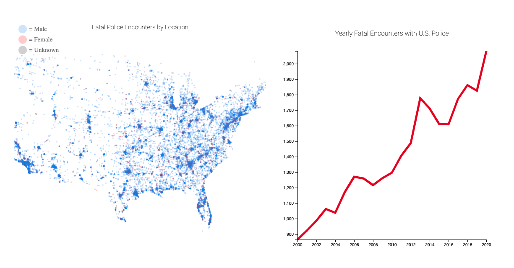
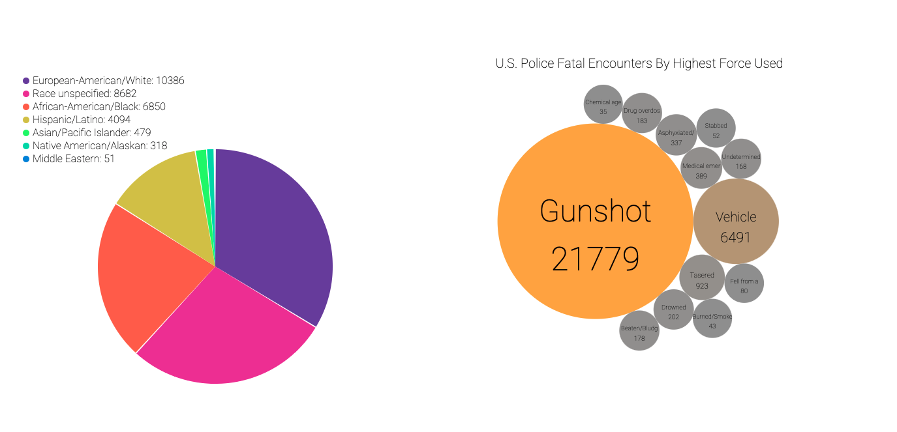
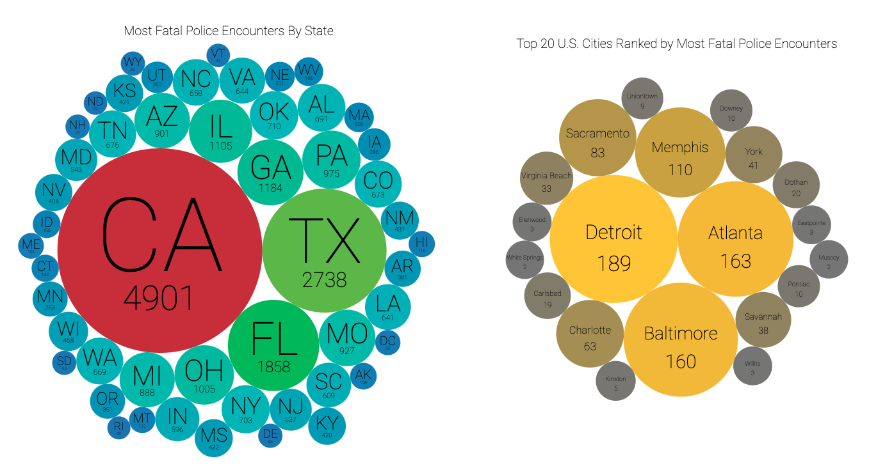

# Visualizing Fatal Police Encounters in the United States Since Year 2000
- There is no official, government collected national data on how many people are killed by U.S. police officers each year.
  * [don't believe me? ( judiciary.senate.gov )](https://www.judiciary.senate.gov/download/blumenthal-record-sub-12914)
- This data was crowd sourced form news reports. While likely incomplete, this is the closest we have to real statistics.

## Live Deployment
  * Check out the [live project](https://www.jonathanewarner.com/police-fatal-encounters-visualization/)

## Screenshots

## Test it Locally
  * Launch index.html in any browser and go crazy.

## Technologies Used
  * Javascript and D3.js

## Credit
  * Thanks to [fatalencounters.org](https://www.fatalencounters.org) for the dataset.